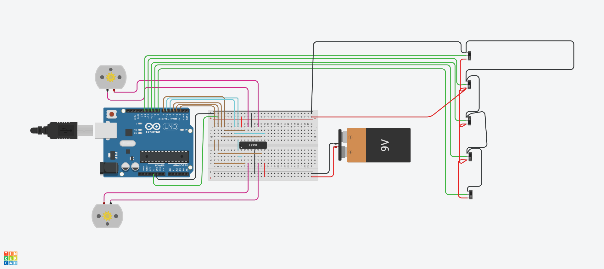

# Line Follower Bot - by Anuraj(B25200)
This Repo contains simple arduino code for Line-Follower-Bot using both logic statements and PID algorithm.

## What i Did

- Designed a circuit in Tinkercad.
- Made the basic algorithm using if-else statement
- Learned what is PID and how to implement it in Line-Follower
- Made another algorithm for line follower using PID

## Circuit Design

Using TinkerCad made a basic circuit which works finely.

- [@TinkerCad](https://www.tinkercad.com/things/9oPPQMCklbh-super-blorr/editel?returnTo=https%3A%2F%2Fwww.tinkercad.com%2Fdashboard&sharecode=ds2kq7yWW_t7GA79uUtYYnAyVPc-XKxIzpqzvWm3aKo&sharecode=ds2kq7yWW_t7GA79uUtYYnAyVPc-XKxIzpqzvWm3aKo)

- 

## What I understood about PID

  

- PID control is a feedback loop mechanism that calculates an "error" value and then applies a correction based on three terms:
	- Proportional(P): Reacts to the current error (how far off the line the robot is).
	
	- Integral(I): Corrects for accumulated past errors (to eliminate steady-state errors or persistent drifts).
	- Derivative(D): Reacts to the rate of change of the error (to dampen oscillations and prevent overshooting).

- Implementation:
	- Error Calculation: I used weighted average method to calculate the error.
	The central sesnor(IR3) has a weight of 0 and left sesnors have negative
		weight(IR1->(-2) and IR2 -> (-1)) and right sensors have +ve weight
		(IR4 -> 1 and IR5 -> 2). 
		Sensor give 1 if it is in white part and 0 if it is in black.
		Let that values stored in IR1, IR2, IR3, IR4, IR5. 
		Then `error = IR1 * -2 + IR2 * -1 + IR4 * 1 + IR5 * 2`
	- Proportional term: `prop_term = kp * error`
	- Integral term: `integral_term += ki * error`
	- Derivative_term = kd * (error - previous)
	- > Note: I assumed the time interval dt as a constant, and combined it with kd and ki.

## Simulation and Testing
**Tinkercad:** I utilized Tinkercad Circuits for building and testing the initial circuit design and the basic `if-else` line following code.
 
> Due to the manually controlled switches and inability to simulate the continuous sesnor changes, i'm unable to test the PID algorithm and tuning.

## Challenges Faced

- Tinkercad Sensor Limitations: Primary challange in Tinkercad was the IR sensor, i cant control the output of IR sensor, without that i can't test whether my code is working or not. 
So for testing i changed the IR sensor to a sliding switch.

- PID tuning without a good simulator: Inability to simulate the continuous sensor changes made it impossible to tune the constants. When i run the PID code in tinkercad, the due to the constant value of error (Since the sensor values are constant ) the integral term become larger and larger. So it is not possible to test it.

##  New things I learned
- **PID** theory
- A good refresher for my arduino coding, which had been stopped for years during JEE prepration.

## References I used
- [L293d motor driver](https://lastminuteengineers.com/l293d-dc-motor-arduino-tutorial/)
- [PID](https://www.youtube.com/watch?v=tFVAaUcOm4I) 